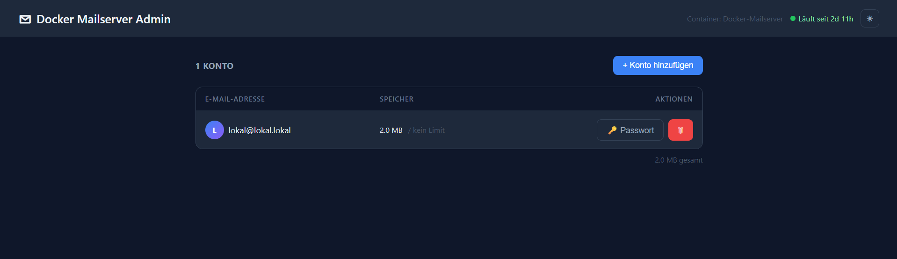

# DMS Vault

A simple web interface for managing email accounts in [Docker Mailserver](https://github.com/docker-mailserver/docker-mailserver).

 



> **Disclaimer:** This project was built with a Vibe Coding approach — iterative, AI-assisted development without formal auditing or test coverage. It is intended for **personal/homelab use only** and is **not suitable for public-facing or production deployments**. Use at your own risk.

## Features

- List all email accounts with disk usage per mailbox
- Create new accounts
- Change passwords
- Delete accounts
- Total storage summary across all mailboxes
- **One-click full backup** — downloads all mails + config as `dms-backup-YYYY-MM-DD.tar.gz` (standard Maildir format, importable into Thunderbird, Dovecot, Evolution and others)
- Container status display (running state + uptime)
- Configurable auto-refresh + manual refresh button
- Dark/Light mode toggle (saved in browser)
- Protected by HTTP Basic Auth

## Requirements

- Docker & Docker Compose
- Docker Mailserver running on the same host
- Access to `/var/run/docker.sock`

## Installation

### 1. Clone the repository

```bash
git clone https://github.com/apulanto-ai/dms-vault.git
cd dms-vault
```

### 2. Configure `docker-compose.yml`

```yaml
environment:
  DMS_CONTAINER: Docker-Mailserver   # exact name of your DMS container
  ADMIN_USER: admin                  # web UI login username
  ADMIN_PASSWORD: changeme           # web UI login password
```

> The container name is **case-sensitive**. Check yours with `docker ps`.

### 3. Start

```bash
docker compose up -d --build
```

The web interface is available at `http://<your-host>:8181`.

## Unraid

1. Copy the project folder to `/mnt/user/appdata/dms-vault/`
2. Edit `docker-compose.yml` and set `DMS_CONTAINER`, `ADMIN_USER`, `ADMIN_PASSWORD`
3. Install the **Compose Manager** plugin (via Community Applications) and deploy, **or** run manually via Unraid terminal:
   ```bash
   cd /mnt/user/appdata/dms-vault
   docker compose up -d --build
   ```
4. Open `http://<unraid-ip>:8181` in your browser

## Environment Variables

| Variable | Default | Description |
|---|---|---|
| `DMS_CONTAINER` | `docker-mailserver` | Name of the DMS container |
| `ADMIN_USER` | `admin` | Web UI username |
| `ADMIN_PASSWORD` | `changeme` | Web UI password |
| `PORT` | `8080` | Internal container port |

## Security

- The Docker socket is mounted **read-only** — the container can only exec into DMS, not control other containers.
- All API inputs are validated before being passed to DMS.
- Commands are passed as argument arrays (no shell interpolation), preventing command injection.
- It is recommended to run this on a private network only and not expose it to the internet.

## Changelog

### v0.6.2
- Fix: page title and navbar header renamed to DMS Vault

### v0.6.1
- Rename: project is now called **DMS Vault** (repo, container, package, docs)
- Fix: rate limiting now applies to `/api/` routes only — static files no longer consume rate limit quota

### v0.6.0
- Full backup download: streams `/var/mail` + `/tmp/docker-mailserver` as `dms-backup-YYYY-MM-DD.tar.gz`
- Backup button in toolbar with loading indicator

### v0.5.1
- Manual refresh button (↻) next to the auto-refresh selector
- Auto-refresh defaults to 1 minute on first use

### v0.5.0
- Dark/Light mode toggle with localStorage persistence
- Total storage summary below account table
- Actual mailbox disk usage shown via `du` even without quota configured

### v0.4.0
- Quota display per account (usage / limit with progress bar)
- Container status indicator in header (running state + uptime)
- New `/api/status` endpoint via Docker inspect

### v0.3.2
- Dynamic Docker socket GID detection at container startup via entrypoint script
- Fixes permission errors across hosts with different socket GIDs (e.g. Unraid GID 281)

### v0.3.1
- Run container as non-root user (`node`) for reduced attack surface

### v0.3.0
- Rate limiting (20 req/min) against brute-force on Basic Auth
- Alpine.js bundled locally — no CDN dependency

### v0.2.0
- Input validation on all mutating routes (email format, password length)
- Internal error messages no longer leaked to the client
- Docker socket mounted read-only

### v0.1.0
- Initial release: list, create, delete accounts, change passwords
- HTTP Basic Auth, Docker socket exec via dockerode

## License

MIT
